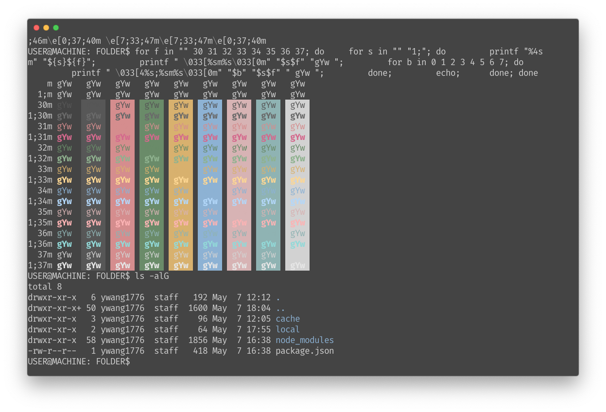

# hyper-seoul256
This is a port of the [seoul256.vim](https://github.com/junegunn/seoul256.vim/) theme works on the [Hyper](https://hyper.is) terminal.

# Preview


# Installation
```
hyper install hyper-seoul256
```

# License
[MIT](./LICENSE)
